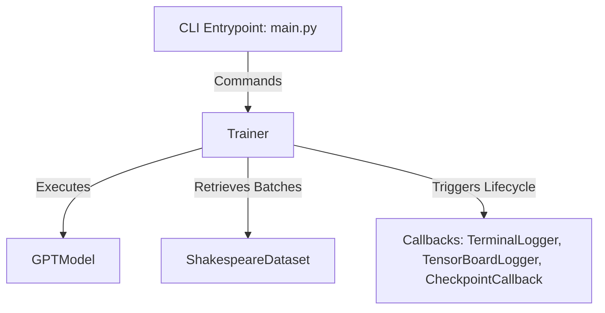

# NanoGPT Benchmarking Environment

A modular, clean, and highly extensible training and evaluation platform for language model architectures.

## Features

- 🤖 **Modular Design**: Structured around clean abstract base classes: [Model](src/base/model.py), [Dataset](src/base/dataset.py), [Callback](src/base/callback.py), and [Logger](src/base/logger.py).
- 🚀 **Typer & Rich CLI**: Interactive command-line interface supporting model training, checkpoint validation, and sequence generation with styled terminal formatting.
- 📉 **TensorBoard Logs**: Automatic logging of step-level and evaluation-level metrics (Loss, LR, step times, and MFU).
- 💾 **Smart Checkpointing**: Saves both the last run and the best performing model checkpoint based on validation loss.
- 🧪 **Comprehensive Tests**: Integration and unit tests covering all components, trainer hooks, and command-line interfaces.

---

## Architecture Overview



---

## Installation & Setup

Ensure you have [uv](https://github.com/astral-sh/uv) and [conda](https://docs.conda.io/en/latest/) installed, then run the commands inside the benchmark conda environment:

```bash
# Setup dependency packages using uv
conda run -n uv-env uv sync
```

---

## CLI Interface Usage

You can execute commands through the root entry point `main.py`:

### 🚀 1. Train a Model
Train a GPT model using a YAML configuration file path. You can override parameters on the fly:
```bash
python main.py train path/to/config.yaml --learning-rate 1e-4 --steps 5000 --batch-size 32
```
*Outputs are saved under `runs/run_YYYYMMDD_HHMMSS/` containing checkpoints, TensorBoard event files, and logs.*

### 🔍 2. Evaluate Checkpoint
Run model evaluations against the validation dataset split to calculate the average loss:
```bash
python main.py eval --checkpoint-path runs/run_xxx/last_ckpt.pt --eval-iters 100
```

### ✨ 3. Text Generation (Inference)
Complete textual sequences using your trained model weights:
```bash
python main.py inference --checkpoint-path runs/run_xxx/best_ckpt.pt --prompt "To be, or not to be" --max-new-tokens 250 --temperature 0.8
```
*You can also read prompts from a text file using `--prompt-file / -f` option.*

---

## Running the Test Suite

Run all unit and integration tests inside the environment using pytest:

```bash
conda run -n uv-env uv run --with pytest python -m pytest
```