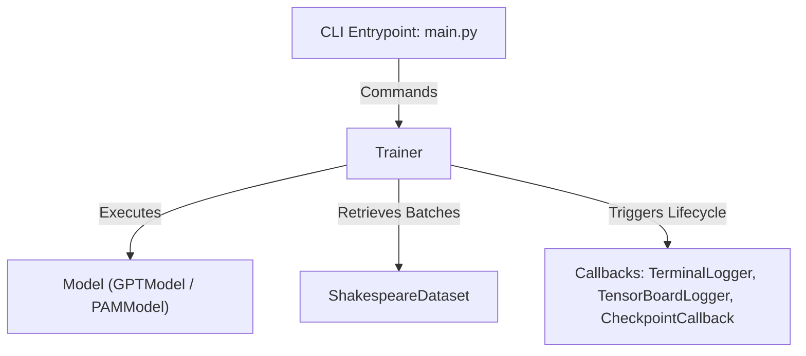

# NanoGPT Benchmarking Environment

A modular, clean, and highly extensible training and evaluation platform for language model architectures.

## Features

- 🤖 **Modular Design**: Structured around clean abstract base classes: [Model](src/base/model.py), [Dataset](src/base/dataset.py), [Callback](src/base/callback.py), and [Logger](src/base/logger.py). Supports multiple model architectures, including standard **GPT** and **Phase-Associative Memory (PAM)**.
- 🚀 **Typer & Rich CLI**: Interactive command-line interface supporting model training, checkpoint validation, and sequence generation with styled terminal formatting.
- 📉 **TensorBoard Logs**: Automatic logging of step-level and evaluation-level metrics (Loss, LR, step times, and MFU).
- 💾 **Smart Checkpointing**: Saves only the single best checkpoint file formatted with step count and monitor validation loss (`ckpt_step_{step}_val_loss_{loss}.pt`), saving disk and Drive space.
- ☁️ **Google Drive Sync & Resuming**: Synchronize training runs to Google Drive in Google Colab or cloud environments (`python main.py sync upload/download/list`) and seamlessly resume training (`--resume`).
- 🧪 **Comprehensive Tests**: Integration and unit tests covering all components, trainer hooks, and command-line interfaces.

---

## Architecture Overview


```mermaid
graph TD
    CLI[CLI Entrypoint: main.py] -->|Commands| Trainer[Trainer]
    Trainer -->|Executes| Model["Model (GPTModel / PAMModel)"]
    Trainer -->|Retrieves Batches| Dataset[ShakespeareDataset]
    Trainer -->|Triggers Lifecycle| Callbacks[Callbacks: TerminalLogger, TensorBoardLogger, CheckpointCallback]
```

---

## Installation & Setup

Ensure you have [uv](https://github.com/astral-sh/uv) installed, then run the commands:

```bash
# Setup dependency packages using uv
uv sync
```

---

## CLI Interface Usage

You can execute commands through the root entry point `main.py` (which runs `src/cli.py`):

### 🚀 1. Train a Model
Train a model using a YAML configuration file path. You can override parameters on the fly:
```bash
# Train standard GPT model with custom overrides:
python main.py train configs/train_shakespeare.yaml --learning-rate 6e-4 --steps 5000 --batch-size 32 --eval-interval 100 --log-interval 10

# Train Phase-Associative Memory (PAM) model:
python main.py train configs/train_shakespeare_pam.yaml --learning-rate 6e-4 --steps 5000 --batch-size 32

# Lightweight CPU training (ideal for Google Colab CPU instances):
python main.py train configs/train_cpu_light.yaml --steps 50
python main.py train configs/train_cpu_light_pam.yaml --steps 50
```
*Outputs are saved under `runs/run_YYYYMMDD_HHMMSS/` containing the best checkpoint (`ckpt_step_X_val_loss_Y.pt`), TensorBoard event files, and logs.*

### 🔍 2. Evaluate Checkpoint
Run model evaluations against the validation dataset split to calculate the average loss:
```bash
python main.py eval --checkpoint-path runs/run_xxx/best_ckpt.pt --eval-iters 100
```

### ✨ 3. Text Generation (Inference)
Complete textual sequences using your trained model weights:
```bash
python main.py inference --checkpoint-path runs/run_xxx/best_ckpt.pt --prompt "To be, or not to be" --max-new-tokens 250 --temperature 0.8
```
*You can also read prompts from a text file using `--prompt-file / -f` option.*

### 📊 4. Visualizing & Comparing Runs (TensorBoard)
Visualize step-level and evaluation metrics, or compare multiple runs with custom aliases using TensorBoard:
```bash
# View all runs under the runs/ directory:
tensorboard --logdir=runs

# Compare specific runs with custom labels using --logdir_spec:
tensorboard --logdir_spec=GPT:runs/run_xxx,PAM:runs/run_yyy
```

### ☁️ 5. Syncing Runs with Google Drive & Resuming (Google Colab / Cloud)
Sync training runs to Google Drive and continue training sessions across multiple days:
```bash
# 1. Fast CPU test training run (ideal for Google Colab CPU instances):
python main.py train configs/train_cpu_light.yaml --steps 50

# 2. Upload the latest training run to Google Drive:
python main.py sync upload --latest

# 3. List local vs. Google Drive training runs status:
python main.py sync list

# 4. Download runs from Google Drive to local storage (in a new session):
python main.py sync download --latest

# 5. Resume training from a downloaded run directory:
python main.py train configs/train_cpu_light.yaml --resume runs/run_xxx --steps 100
```
*You can also invoke `python scripts/sync_runs.py upload|download|list` directly.*

---


## Running the Test Suite

Run all unit and integration tests inside the environment using pytest:

```bash
PYTHONPATH=. uv run pytest
```